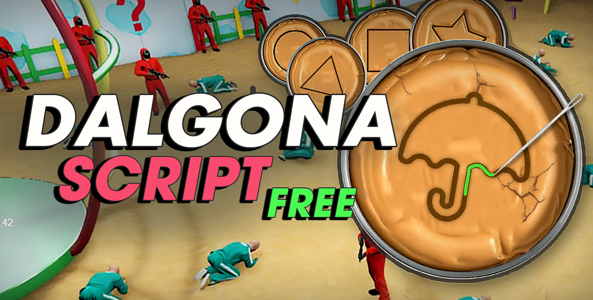
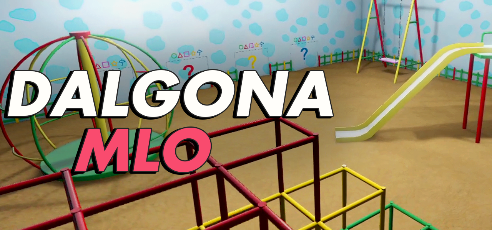
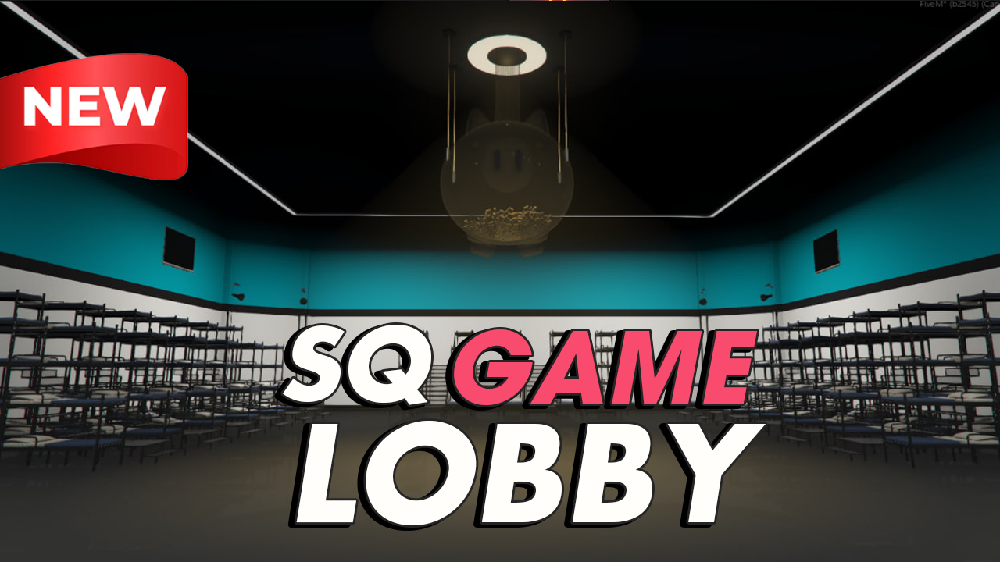
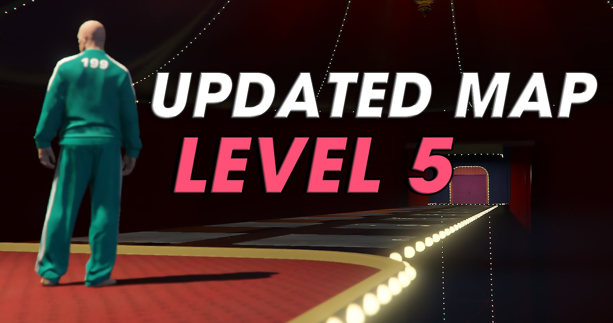

# About

> Dalgona (달고나) or ppopgi (뽑기) is a Korean candy made with melted sugar and baking soda originating from South Korea.

This is a game where you need to cut a pattern in a candy using a needle, for a limited time. As a reward — a lot of money waiting for you. But if you lose, your life is at stake.

<p align="center">
  
</p>

## [Showcase](https://www.youtube.com/watch?v=Bww0deh7Rbo)
Watch the video showcase. 

# Features
Resource is highly configurable and has next features:

- **Mini-Game**. Attractive mini-game with Dalgona Candy made purely with native drawing functions without using HTML.
- **Sound Design**. Mini-game, countdown and weapon firing on player game over.  
- **5 new candy props**. You can see props in other players hands when playing the game.
- **3 new emotes/poses**. All participants has special pose while they playing the game.
- **Outfits**. Participants and guards clothes included, but you can set up your custom clothes as as well via config file.
- **Blood and Stress**. While you are playing you can see and hear how other players and NPC's loose the game and get eliminated.
- **Guards**. Standing around with weapons and watching how you'll lose the game.
- **Multiplayer**. Many players can join the game together.
- **Automatic mode**. Compete with other players in automatic mode where you have timer, money stakes and automatic elimination.
- **Manual (RP mode)**. Use a command `/dalgona-game-manual` to trigger the minigame. When you loose/win - indicator is shown above your head.
- **Optimized**. CPU and Network Optimized. If you are not in game, the script takes less than 0.01 ms and a few requests sent over the network.
- **Plug-and-play**. Standalone, ESX , QB and vRP frameworks are supported;

# MLO

**MLO**. By default we included basic empty MLO for the script. However, you can use our more advanced and custom modelled location with attention to details such as props, lights, shadows! [BUY HERE](https://lumanstudio.tebex.io/package/6697609) and use coupon for 10% discount `OPEN_SOURCE_10PERC`. Additional customer support is provided for the MLO + Script via [Discord](https://discord.com/invite/peYBHeBSGb).

<p align="center">
  
</p>

### Support Our Works on [YouTube](https://www.youtube.com/@lumanstudio)

<div style="display: flex; justify-content: center; gap: 10px;">
  
  
  
</div>

<br><br>

# Installation

Bellow you will find a simple installation inctructions. 

1. Extract `dalgona-game` into your `resources` folder.
2. Install/reinstall [PolyZone](https://github.com/mkafrin/PolyZone) (rename from `PolyZone-master` to `PolyZone`)
3. Update your `server.cfg` to include:

```
ensure dalgona-game
```
4. For clothes, if you don't have FiveM subscription, add this into `server.cfg`:
```
sv_maxclients 10
```

# Frameworks

**ESX/QB:**

No manual setup is required — the framework is detected automatically. However, if you have renamed it, make sure to update the name in `shared/framework.lua` accordingly.

**vRP:**

In `fxmanifest.lua`, remove the `--` before `@vrp/lib/utils.lua`.


# Support

You can open Issue here on the Github with critical errors if any appears. For new features proposals feel free to join Luman Studio's Discord and share your idea there.

Luman Studio also provide **paid** on-demand support on [Discord](https://discord.com/invite/peYBHeBSGb).
For those who bought [MLO](https://lumanstudio.tebex.io/package/6697609) — support is for free.

# Our Tebex

https://lumanstudio.tebex.io/

# License

Thanks to [Luman Studio](https://lumanstudio.tebex.io/) this script remains as open source. Please, respect their work and follow the rules of attached license.
